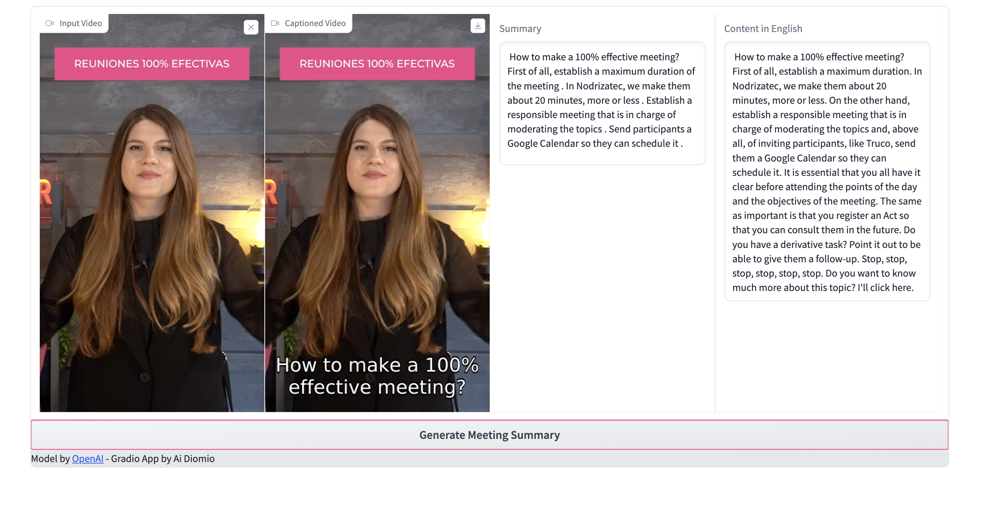

# Minute Master - Your usual meetings but better!

Aren't we all tired of missing important meetings? or having to go through a long video of a meeting we missed?

This solution  can help:

* Add translation captions for those meetings that are not in English
* Give you a summary  and a list of highlights of the topics disscussed on the meeting.
* Write the Action Items that were agreed on the meeting.





## Set up

### Use the docker image

You can find a container in docker.io/slancheros/minute_master. Run it and it will forward to the port 7862

### Run the container by clonning this repository

1. Git clone the repository https://github.com/slancheros/whisperAPI
2. On the root of the project run 
```
docker build . -t minute_master
```
Then 
```
 docker run --rm -it -p 7862:7860 --name gradio_container minute_master
```
## How to run it successfully
In the code above there is an error that we could not see here . This is why we created a container in 
docker.io/slancheros/minute_master. You can run the container and it will forward to port 7862 on localhost.

Recommendations:
1. Use a 30 seconds video ( a short from youtube should work)
2. The video should have a name without spaces or special characters

Please find the repository here:

https://github.com/slancheros/whisperAPI


<mark >We strongly recommend use the containers since for video generation we use ffmpeg </mark>  
The meeting summary generation would likely not work on the notebook or running the gradio locally if you don't have ffmpeg installed.

# Future Considerations

This is the hackathon version but for a production one there are, of course, additional steps to take.

1. For longer meeting videos we can build a pipeline that takes segments of 30 seconds. process them and build an aggregated captioned video. We have seen libraries like moviepy that can serve this purpose.
2. For build up a more robust intelligence, models can be reused by subsequent sub-videos and the model build can be factorized.
3. For adding more intelligence functions we have built a proposed MinuteMaster processor that can add multiple functions. Each processor can run on a thread to help provide better performance.
4. Additionally there is a faster model called JAX that can be used to process a 30 min video in a matter of seconds. The code is not released, but may be in the future it will be open and will make this process more efficient.
5. A vector database can be fed with the transcript of the meeting to build a question-answer feature.